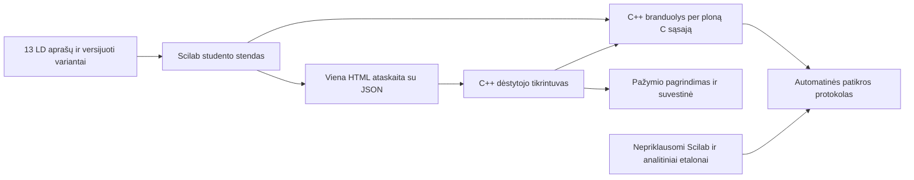

# 13 LD sistemos techninių sprendimų patikra

Data: 2026-09-11. Pradinė versija: `c2f2f940b2c111746cafe47d8e5f3c80aa7fc680`.

**Verdiktas: C++ branduolio ir Scilab stendo kryptis pagrįsta veikiančiais bandymais Linux aplinkoje. Pradėti bendro pagrindo įgyvendinimą galima. Visų 13 LD masinis perkėlimas turi prasidėti po Windows ir trijų skirtingų darbų visos eigos patikrų. Aprobacija dar neatlikta.**

Vartotojas patvirtino: C/C++ branduolys privalomas, studentai ir dėstytojas naudos Windows bei Linux, aprobuos išorinis vertintojas. Vertintojas dar nenustatė kriterijų; vartotojo prašymu parengta [minimali vidinė priėmimo bazė](MINIMALUS_PRIEMIMAS.md). Teorijos failų turinys šios patikros metu neskaitytas. Likusių LD metodikų detalės nepatvirtintos.

Šiame kataloge yra vykdomi architektūros bandymai ir jų įrodymai. Tai nėra nauja išleista studentų programos versija. Dabartinis `studentui/` paketas nepakeistas.

## Patikrinta praktiškai

Mašininis protokolas: [evidence/verdict.json](evidence/verdict.json). Visi žemiau nurodyti sėkmingi rezultatai yra Linux, Scilab 2026.1.0, GCC 14.2 / C++17 aplinkoje.

| Bandymas | Rezultatas ir ribos |
|---|---|
| Bendras tiesinių grandinių modelis | 844 palyginimai su formulėmis: DC daliklis, RC/RL, nuoseklus ir lygiagretus RLC, galia, keli šaltiniai, simetrinė ir nesimetrinė trifazė grandinė, DC ribiniai atvejai. Tai nėra 844 baigti LD variantai. |
| Tikras C++ modelis | 583 atskiro C++/Eigen mazginių lygčių sprendimo palyginimai su Scilab modeliu; lyginamos mazgų įtampos ir šaltinių srovės. |
| Scilab → C++ | Tikra dinaminė biblioteka per `link/call`; 650 įrašų su realiąja ir menamąja dalimis, netinkami įrašai gauna atskirą klaidos būseną. |
| C++ atminties patikra | ASan ir UBSan bandymai praėjo. Atskira bandymo programos ASan/LSan/UBSan patikra už smėliadėžės taip pat praėjo; galutiniame automatizuotame protokole LSan išjungtas dėl ptrace apribojimo. Produkto branduolio nuotėkių patikra lieka priėmimo darbų sąraše. |
| Viena HTML ataskaita su JSON | Scilab įrašė 650 sintetinių ataskaitų. C++ programa perskaitė ir perskaičiavo vieną RC srovės užduotį pagal savo patikimą variantų banką. |
| Vertinimo rezultatas | 564 teisingi, 48 klaidingi, 38 trūkstami atsakymai; visus rezultatus ir etalonus nepriklausomai patikrino Python bandymų programa. Į ataskaitą įrašytas tariamas pažymys ignoruotas. |
| Atkuriamumas | Pakartotinio įvertinimo JSON sutapo baitas į baitą. |
| Sugadinti duomenys | 12 netinkamų failų perduoti peržiūrai be pažymio, 1 teisingas failas įvertintas, 1 pakartotinis pateikimas pažymėtas kaip dublikatas. Kiti failai apdoroti toliau. |
| Duomenų sandūra | UTF-8 vardai ir keliai su tarpais, tekstas su HTML žymomis, vieno elemento masyvas, trūkstamas skaičius. |
| Esamas ZIP | Visų 35 vykdomųjų failų atitikties kontrolė praėjo. |

650 mažų vienos užduoties ataskaitų C++ bandymas truko apie 0,17 s šiame kompiuteryje. Šio skaičiaus negalima laikyti 650 pilnų 13 LD ataskaitų našumo pažadu.

## Pasirinktas įgyvendinimo karkasas



- **C++17 + CMake.** Vienas skaičiavimo ir vertinimo branduolys. GUI valdikliai, globali Scilab būsena ir asmens duomenų saugojimas neįtraukiami į skaitinį sprendiklį.
- **Eigen 5.0.0** skaitinėms matricoms ir **nlohmann/json 3.12.0** duomenims. Abi bibliotekos naudojamos iš antraščių; vartotojui jų diegti ar kompiliuoti nereikia. Tikslios versijos ir atsisiųstų šaltinių SHA-256 užfiksuotos [dependencies.lock.json](dependencies.lock.json). Bandymų paleidiklis tikrina ir išskleistų Eigen antraščių atitiktį archyvui.
- **Scilab** išlaiko bendrą stendo vaizdą, prietaisų valdymą ir grafikus. Dabartiniai LD1/LD2 skaičiavimai paliekami etalonams, kol jų pakeitimas palygintas. Jų negalima mechaniškai nukopijuoti 13 kartų.
- **Siaura C ABI sąsaja:** skaičių masyvai, aiškūs matmenys, versija ir klaidų kodai. Kompleksiniai skaičiai perduodami dviem `double` masyvais. C++ išimtys, `std::string`, STL konteineriai ir atminties nuosavybė neperduodami tarp Scilab ir DLL/SO.
- **Dėstytojo programa** naudoja tą patį C++ branduolį paketiniam tikrinimui. Ji gali būti atskiras vykdomasis failas; aplanko pasirinkimą pirmoje versijoje gali pateikti jau turimas Scilab langas. Taip neprireikia papildomo GUI karkaso.
- **JSON schemos versija** atskirta nuo branduolio, LD, variantų banko ir vertinimo taisyklių versijų. Naujinimas nekeičia seno pateikimo taikomų taisyklių. Nežinoma versija gauna būseną „Reikia peržiūros“.
- **Bendras šablonas** aprašo grandinę, elementų vietas, etapus, matavimo taškus, lenteles, grafikus, atsakymų tipus ir vertinimo kriterijus. Fiksuotoms schemoms numatyti scenų išdėstymai, o naujoms funkcijoms — ribota plėtinių sąsaja. Universalus schemų redaktorius šiems 13 darbų nereikalingas.

## Apimties ribos, kurios apsaugo nuo brangaus perrašymo

Pagal turimą 13 LD sąrašą pirmasis modelis skirtas tiesinėms RLC grandinėms: nusistovėjusiai DC ir sinusoidinei AC analizei. Trifazė grandinė sudaroma iš trijų fazinių šaltinių tame pačiame sprendiklyje. Gali būti modeliuojamos šaltinių ir prietaisų vidinės varžos. Visi dydžiai branduolyje yra SI; AC įtampos ir srovės — RMS, fazės atskaita ir ženklai dokumentuojami.

Netiesinių puslaidininkių, magnetinio soties modelio, pereinamųjų procesų, realaus laiko aparatinio valdymo ar savavališkų SPICE modelių poreikis reikštų apimties pakeitimą. Kol detalios metodikos neperžiūrėtos, negalima teigti, kad jų tikrai nebus. Jei toks reikalavimas atsirastų, atskira sprendiklio sąsaja leidžia prijungti kitą variklį; jo integracijos ir patikros kaina būtų vertinama atskirai.

13 darbų nereikia 650 kartų programuoti. 13 × 64 reiškia 832 variantų konfigūracijas, o 50 × 13 — 650 studentų pateikimų. Kiekvieno varianto leistinus parametrus ir visą užduoties eigą tikrina automatinis testas.

## Rizikų registras ir uždarymo sąlygos

„Patikrinta“ reiškia konkretaus bandymo apimtį. „Suprojektuota“ nėra įgyvendinimo ar aprobavimo patvirtinimas.

| ID / dalis | Būsena | Konkretus sprendimas ir uždarymo sąlyga |
|---|---|---|
| R01 C++ ↔ Scilab | Patikrinta Linux | Naudoti ploną C ABI, matmenų ir versijos tikrinimą, klaidos kodus. Windows DLL įkėlimas, kompleksiniai masyvai ir klaidų kelias turi praeiti tikrame Windows Scilab. |
| R02 Skaitinis modelis | Galimybė patikrinta | C++/Eigen ir nepriklausomi etalonai. Gamybinėje versijoje nustatyti elementų diapazonus, matricos mastelio keitimą, liekanos ir sąlygotumo ribas. Bandymo `rcond` slenkstis nėra visų galimų grandinių tinkamumo įrodymas. |
| R03 Grandinės jungimas | Reikia įgyvendinti | Laidus paversti elektriniais mazgais, tikrinti elektrinį ekvivalentiškumą ir matuoklio vietą. LD2 dabar atmeta visus ne iš anksto išvardytus laidus; negalima šio elgesio vadinti laisvu grandinės tyrimu. Atskirti atjungtą grandinę, trumpą jungimą ir nesuderinamus idealius šaltinius. |
| R04 Bendras stendo šablonas | Reikia visos eigos bandymo | Tas pats ekranas turi atlikti DC daliklį, rezonanso dažnių tyrimą ir trifazį žvaigždės/trikampio darbą. Patikrinti tikrus mygtukus, išsaugojimą, atkūrimą ir ataskaitą. Dabartiniai skaitiniai bandymai šios patikros nepakeičia. |
| R05 Studentų atsakymai | Rastas trūkumas | LD1 `ld1_check_step` dalį `LD1.res` užpildo teoriniais dydžiais, nors tikras tekstas laikomas `stepQ`. Nauja ataskaita turi saugoti tikrus įvestus atsakymus ir nepriklausomus matavimus. Seno CSV nepakanka pilnam patikimam pervertinimui. |
| R06 Įvedimo vykdymas | Rastas trūkumas | LD1 `ld1_parse_number` vykdo `evstr`. Nekenkiančios funkcijos iškvietimas praktiškai patvirtino šalutinį poveikį. Prieš plėtrą pakeisti bendru baigtinių skaičių analizatoriumi; ataskaitų importas niekada nevykdo `evstr`, `exec` ar studento kodo. C++ skaitytuvo bandymas tekstinį „atsakymą-programą“ atmetė. |
| R07 Vertinimo prasmingumas | Reikia suderinti ir įgyvendinti | Atskirti mokymosi pagalbą ir atsiskaitymą. Vertinamame pateikime leidžiami klaidingi atsakymai; vien „etapas atliktas“ nėra pažymys. Dėstytojo patvirtinti balai, daliniai balai, paklaidos ir išvestinės klaidos taisyklė. |
| R08 Išvados | Metodinis sprendimas atviras | Strukturinti tik ten, kur tai atitinka mokymosi tikslą. Laisvo teksto buvimas nėra jo teisingumas. Nepriklausomo samprotavimo automatinio įvertinimo šis projektas dar neįrodė. Jei vertintojas reikalauja savarankiško paaiškinimo, būtina žmogaus peržiūra ar atskirai patvirtinta vertinimo procedūra. |
| R09 Ataskaitų formatas | Transportas patikrintas | Vienas HTML su įterptu JSON, UTF-8, tekstų ekranavimas. C++ skaito duomenų bloką nevykdydamas HTML; matomą vertinimo peržiūrą generuoja iš tų pačių perskaitytų duomenų. Trūkstamas skaičius turi būseną: Scilab `null` viename lauke virsta `[]`. |
| R10 Failų saugojimas | Reikia įgyvendinti ir tikrinti | Darbo failai atskirai nuo įdiegto programos katalogo. Laikinas failas tame pačiame diske → patikra → atominis pakeitimas; ankstesnė atsarginė kopija. Windows užrakinto failo, pilno disko, neturimų teisių ir avarinio uždarymo bandymai. Dabartinis `.sod` formatas nėra bendras C++ mainų formatas. |
| R11 Paketinis vertinimas | Ribotas bandymas praėjo | 650 vienos RC užduoties ataskaitų ir 12 netinkamų atvejų. Produkto versijoje papildomai visų LD duomenys, didelės matavimų lentelės, atšaukimas/tęsimas, nenurašytų failų suvestinė, pataisytų pateikimų istorija. |
| R12 Windows/Linux diegimas | Windows dar nepatikrintas | Iš pradžių x64; Windows 10/11 ir konkretus Linux bazinis leidimas. Kompiliuojame mes, vartotojams perduodame DLL/SO/EXE. Linux surinkimas seniausioje palaikomoje bazėje, ne vien šiame Debian 13 su glibc 2.41. Windows tikrinti MSVC runtime, Unicode kelius, DPI, teises ir antiviruso elgesį. |
| R13 Duomenų tikrumas | Priėmimo sąlyga atvira | Vietinis failas ir jo SHA neįrodo autoriaus ar sąžiningo darbo. Studentas valdo savo kompiuterį; C++ kompiliavimas to nepakeičia. Registracija, grupės sąrašas ir pateikimo istorija padeda administruoti. Jei reikės kriptografiškai patikimo kilmės patvirtinimo, tai atskiras serverio/LMS ar prižiūrimo atsiskaitymo reikalavimas. |
| R14 Patikima konfigūracija | Bandymo principas patikrintas | Vertintojas naudoja savo LD ir variantų bankus, neprima balų ar formulių iš ataskaitos. Produkto leidimo manifestas susieja branduolį, metodikas, bankus, schemas ir rubrikas. Nežinoma ar sumaišyta versija negauna automatinio pažymio. |
| R15 Licencijos ir priklausomybės | Inventorius pradėtas | Eigen/MPL-2.0, JSON/MIT, Scilab/GPL-2.0. Šioje saugykloje bendros projekto `LICENSE` nėra. Prieš platinimą savininkas nustato projekto licenciją ir turinio teises; išlaikomi priklausomybių pranešimai. Scilab pradžioje diegiamas oficialiu diegikliu atskirai, nes jo perpakavimas papildytų diegimo ir licencijų darbą. |
| R16 Aprobacija ir metodikos | Atvira, išorinė | Gauti priėmimo kriterijus; patvirtinti, kad virtualūs bandymai tenkina šių LD mokymosi tikslus. Kiekvienam LD: tikslas → užduotis → rubrika → testas → rezultatas → vertintojo sprendimas. Bendro variklio patikra nepakeičia 13 metodikų vertinimo. |

## Sprendimai, kurių dabar neapsimoka dubliuoti

1. Visus skaičiavimus ir pažymio skyrimą laikyti C++ branduolyje; Scilab etalonai skirti bandymams, o ne antram veikiančiam vertintuvui.
2. Vienas stendo šablonas ir 13 aprašų. Išsaugojimas, eksportas, klaidų pranešimai ir variantų parinkimas programuojami vieną kartą.
3. Matricų ir JSON bibliotekas naudoti su užfiksuotomis versijomis. Nerašyti savo bendro matricų sprendiklio ar JSON analizatoriaus.
4. Vienas dokumentuotas ataskaitos formatas. Teksto atpažinimo iš PDF/DOC ir atskiro serverio nereikia dabartiniam aplanko tikrinimo scenarijui.
5. Komponentų nepradėti kompiliuoti studento kompiuteryje. Naujai Scilab ar branduolio versijai rengti naują patikrintą leidimą.
6. Python šiame kataloge naudojamas tik patikrų organizavimui. Studentų ir dėstytojo darbo eiga neturi nuo jo priklausyti.

## Darbų vartai, kad kliūtys išryškėtų pradžioje

| Vartai | Kas turi būti įrodyta | Kada |
|---|---|---|
| G0 Apimtis ir priėmimas | Vertintojo kriterijai, metodikų atitiktis, virtualaus atlikimo ir įrodymų priimtinumas, platinimo teisės | Prieš patvirtinant visų 13 darbų apimtį ir aprobacijos terminą |
| G1 Platforma | Tas pats C++ branduolys ir Scilab sąsaja veikia tikrame Windows ir pasirinktame Linux, su iš anksto sukompiliuotais failais | Pirmas įgyvendinimo etapas, prieš masinį LD kūrimą |
| G2 Visas šablonas | DC, RLC ir trifazis darbas praeina visą kelią nuo įvedimo iki atkurtos sesijos ir pakartojamo pažymio | Prieš likusių LD aprašų užpildymą |
| G3 Visas turinys | 13 patvirtintų metodikų, 832 variantų eigos, klaidingų atsakymų testai, rubrikų ir nepriklausomų etalonų patikra | Prieš studentų naudojimą |
| G4 Leidimas | Pilnų 650 ataskaitų bandymas, gedimų ir atkūrimo scenarijai, dokumentuotas Windows/Linux leidimas, išorinis priėmimas | Prieš paskelbiant sistemą aprobuota |

Ankstesnis 4–5 dienų orientyras neapima įrodyto Windows leidimo ir neapibrėžtos išorinės aprobacijos. Įgyvendinimo terminą pagrįstai perskaičiuosime po G1/G2. Šio audito metu dalis brangiausių techninių nežinomųjų patikrinta, tačiau jų negalima paversti pažadu, kad visi priėmimo darbai jau baigti.

## Pakartoti bandymus

Reikia Linux, C++17 kompiliatoriaus, CMake, Python 3 ir Scilab 2026.1.0. Priklausomybių į savo katalogą atsisiųskite pagal `dependencies.lock.json`, Eigen archyvą išskleiskite ten pat. Paleidiklis pats nieko neatsisiunčia ir neįdiegia.

```bash
python3 audits/architecture-2026-09-11/run_audit.py \
  --deps /tmp/ld-architecture-deps \
  --scilab /visas/kelias/scilab-2026.1.0/bin/scilab
```

Instrumentuotoje smėliadėžėje, kurioje LeakSanitizer negali veikti dėl ptrace, galima pridėti `--sandbox-no-lsan`. Protokole toks apribojimas pažymimas; ASan ir UBSan lieka įjungti. Tai nepakeičia galutinės atminties nuotėkių patikros tinkamoje aplinkoje.

Surinkimas ir sintetiniai failai sukuriami atskirame laikiname kataloge. Tik protokolai patenka į `evidence/`. CMake failas numato MSVC šaką, tačiau Windows bandymų paleidimas ir ataskaitų Unicode keliai šiame audite dar nepatikrinti.

## Pirminiai šaltiniai

- [Scilab C/Fortran kvietimas](https://help.scilab.org/call) ir [dinaminis susiejimas](https://help.scilab.org/link): pagrindas plonai C ABI sąsajai. Windows kvietimo susitarimai tikrinami atskirai.
- [Scilab sisteminiai reikalavimai](https://www.scilab.org/download/system-requirements): Windows 10/11 x64, Linux leidimai ir MSVC 2022 / gcc / clang kompiliavimo aplinka.
- [Scilab 2026.1.0 platinimas ir licencija](https://www.scilab.org/download): GPL v2.0. Papildomi bibliotekų pranešimai nurodyti pačiame Scilab pakete.
- [Eigen](https://libeigen.gitlab.io/): antraščių biblioteka, kompleksiniai skaičiai, matricų sprendimai ir MPL-2.0. [JSON integracija](https://json.nlohmann.me/integration/) ir [MIT licencija](https://json.nlohmann.me/home/license/).
- [ISO/IEC 25010:2023](https://www.iso.org/standard/78176.html): galimas kokybės reikalavimų ir priėmimo kriterijų karkasas; tai nėra šios sistemos sertifikatas ar vertintojo jau nustatytas reikalavimas.
